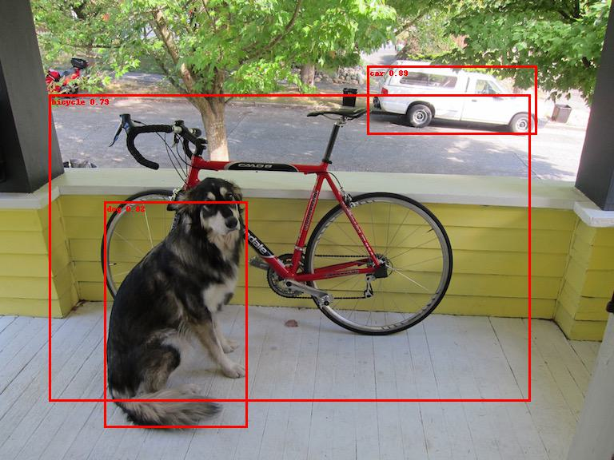
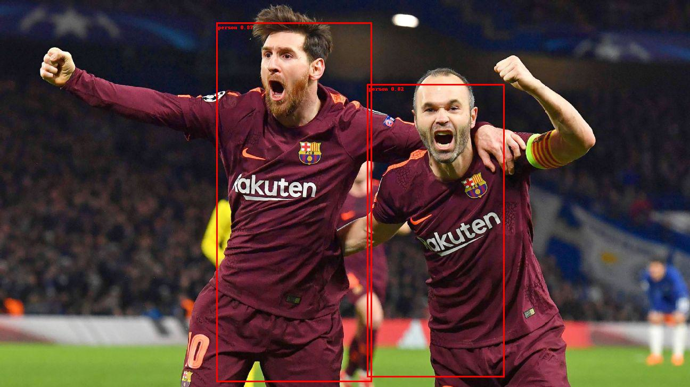

## Introduction
This is my implementation of YOLOv3 in PyTorch. The code contains:

- YOLOv5 model and layers
- Code for PASCAL VOC dataset
- Train and test scripts
- Config file

## Results for YOLOv5s

## References
Original YOLOv5 repository: https://github.com/ultralytics/yolov5 \
Good repo to understand YOLO: [https://github.com/aladdinpersson/Machine-Learning-Collection](https://github.com/aladdinpersson/Machine-Learning-Collection/tree/master/ML/Pytorch/object_detection)